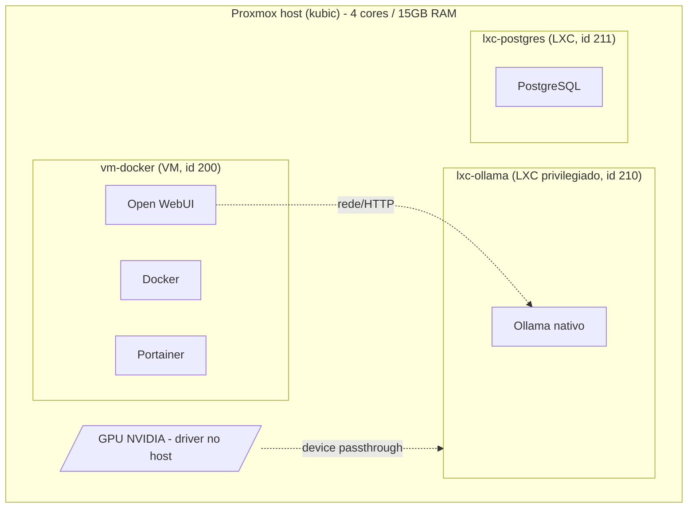

# HomeLabDevelopment

Infraestrutura do homelab em Proxmox, provisionada via Terraform + Ansible:
uma VM para os meus próprios projetos em Docker (com Portainer + Open WebUI),
um LXC rodando Ollama nativo com acesso à GPU, e um LXC com PostgreSQL.

## Arquitetura



- **vm-docker** — VM Ubuntu comum, com Docker + Portainer, pra subir meus
  próprios projetos. Também roda o Open WebUI (fala com o Ollama pela rede).
- **lxc-ollama** — container LXC **privilegiado**, com acesso à GPU via
  *device passthrough* (não passthrough de PCI - ver "Por que LXC e não VM
  para a GPU" abaixo). Roda só o Ollama, **nativo** (sem Docker) - mais
  simples, sem AppArmor/nvidia-container-toolkit pra lidar dentro do LXC.
- **lxc-postgres** — container LXC comum (não privilegiado), só com
  PostgreSQL instalado via apt, acessível pela rede local.

Tudo é criado por um único `terraform apply`: o Terraform sobe a
VM/containers e, assim que cada um tem IP, dispara automaticamente o
playbook Ansible correspondente (via WSL, ver "Como funciona" abaixo).

## Por que LXC e não VM para a GPU

A primeira versão desse projeto passava a GPU inteira (PCI passthrough) pra
dentro de uma VM. Isso **derrubou o host inteiro** por causa do bug de reset
conhecido de GPUs NVIDIA de consumo (quando a VM solta o device, a placa não
rereseta direito e trava o barramento PCI do host todo).

A troca pra LXC evita isso: o driver NVIDIA fica instalado **no host**
(`script/init.sh`), e o container só recebe os arquivos de device
(`/dev/nvidia0`, `/dev/nvidiactl`, etc.) via *device passthrough* - o host
nunca perde o controle da placa, sem VFIO, sem risco de travar o host.

O preço disso: o driver **userspace** dentro do LXC precisa ser exatamente a
mesma versão do módulo de kernel do host (ver `nvidia_driver_version` em
[Variáveis](#variáveis-principais)), senão o `nvidia-smi` dentro do
container dá "Driver/library version mismatch".

## Pré-requisitos

- Proxmox VE já instalado no host, acessível por SSH como root.
- [Terraform](https://developer.hashicorp.com/terraform) instalado no
  Windows (roda em PowerShell).
- **WSL** com Ansible instalado (`sudo apt install ansible sshpass`) - o
  `terraform apply` chama o Ansible através da WSL (ver "Como funciona").
- Uma GPU NVIDIA no host, se for usar o `lxc-ollama` com GPU
  (`enable_gpu = true`).

## Setup do zero

### 1. Bootstrap do host Proxmox

```powershell
cd script
.\run-init.ps1
```

Isso copia e roda `init.sh` no host, que:
- instala o driver NVIDIA no host (se `ENABLE_GPU_HOST_DRIVER=true` e achar
  uma GPU NVIDIA via `lspci`);
- cria o usuário/role/token do Terraform (`terraform@pve`) com as permissões
  necessárias;
- baixa a cloud image do Ubuntu 24.04 e cria o template (vm_id `9000`) usado
  pelo `clone` da `vm-docker`.

Se o script disser que precisa de reboot (driver NVIDIA novo), reinicie o
host e rode `.\run-init.ps1` de novo - ele é idempotente.

Depois, confira a versão do driver instalado:

```powershell
ssh root@<host> "cat /proc/driver/nvidia/version"
```

e ajuste `nvidia_driver_version` no `terraform.tfvars` pra bater exatamente
com essa versão.

### 2. Configura as variáveis

Edite `terraform/terraform.tfvars` com as credenciais da API (o token
impresso pelo `init.sh`), senhas, e ajuste os tamanhos de VM/LXC se quiser
(os defaults já são dimensionados pro host de 4 cores/15GB RAM - some tudo
antes de aumentar).

### 3. Aplica

```powershell
cd terraform
terraform init
terraform apply
```

## Como funciona (Terraform + Ansible + WSL)

O `terraform apply` roda inteiro no PowerShell/Windows, mas o Ansible só
existe na WSL. Pra automatizar isso num `apply` só, cada `terraform_data`
(um por VM/LXC) chama:

```
wsl bash ansible/run.sh <playbook> <ip> <usuario> <senha> [chave=valor ...]
```

`run.sh` existe pra evitar aninhar aspas entre `cmd.exe -> wsl.exe -> bash -c`
(isso quebra fácil - já quebrou algumas vezes construindo esse projeto). Por
isso os argumentos extras são sempre `chave=valor` sem espaço, nunca uma
string com espaço dentro passada entre aspas.

Cada ambiente tem seu próprio playbook, reaplicável na mão a qualquer
momento sem precisar recriar a VM/LXC (são todos idempotentes):

- `ansible/vm-docker.yml` - Docker + Portainer + Open WebUI na vm-docker.
- `ansible/lxc-ollama.yml` - Ollama nativo (+ GPU) no lxc-ollama, sem Docker.
- `ansible/lxc-postgres.yml` - PostgreSQL no lxc-postgres.

## Serviços expostos

| Serviço | Onde | Porta |
|---|---|---|
| Portainer | vm-docker | 9443 (https) |
| Open WebUI | vm-docker | 8080 |
| Ollama API | lxc-ollama | 11434 |
| PostgreSQL | lxc-postgres | 5432 |

Os IPs (DHCP) saem nos outputs do `terraform apply`: `vm_ipv4`,
`ollama_ipv4`, `postgres_ipv4`.

## Variáveis principais

Ver `terraform/variables.tf` pra lista completa e descrições. As mais
importantes pra revisar antes do primeiro apply:

- `proxmox_api_url`, `proxmox_api_token_id`, `proxmox_api_token_secret` - credenciais da API (geradas pelo `init.sh`).
- `vm_ssh_password`, `ollama_lxc_password`, `postgres_lxc_password` - senhas de acesso de cada VM/LXC.
- `postgres_db_name`, `postgres_user`, `postgres_password` - banco/usuário criados dentro do Postgres.
- `enable_gpu` - liga/desliga o device passthrough da GPU pro lxc-ollama.
- `nvidia_driver_version` - **tem que bater exatamente** com a versão instalada no host.

## Estrutura do repo

```
script/
  init.sh          # bootstrap do host Proxmox (driver NVIDIA, template, terraform user)
  run-init.ps1     # copia e roda o init.sh no host via SSH
terraform/
  main.tf          # vm-docker + lxc-ollama + lxc-postgres + orquestração do Ansible
  variables.tf
  terraform.tfvars # credenciais e specs (não commitar valores reais)
  outputs.tf
ansible/
  run.sh           # ponte WSL <-> ansible-playbook (chamado pelo terraform)
  requirements.yml # collections (community.docker, community.postgresql)
  vm-docker.yml    # Docker + Portainer + Open WebUI na vm-docker
  lxc-ollama.yml   # Ollama nativo (+ GPU) no lxc-ollama, sem Docker
  lxc-postgres.yml # PostgreSQL no lxc-postgres
```

## Notas / troubleshooting

- **VM/LXC não sobe (timeout esperando o guest-agent)**: geralmente é
  cloud-init fazendo um `apt upgrade` completo antes do agent subir. Os
  snippets desse projeto já evitam isso (`package_upgrade: false`), mas se
  acontecer de novo, aumente `agent.timeout` no `main.tf`.
- **Erro 403 "Permission check failed"**: falta algum privilégio na role
  `TerraformAdmin`. O `pveum role modify` com a lista completa de privs está
  em `script/init.sh`.
- **"VM configuration to become unlocked" / VM travada no clone**: geralmente
  hardware/storage lento nesse host específico - não é bug do Terraform.
  Confira `qm status <vmid>` e o Task History do Proxmox antes de assumir
  que travou de vez.
- **Nome de VM/LXC com underscore**: Proxmox não aceita `_` em nomes (só
  hífen) - é validado como nome de DNS.
