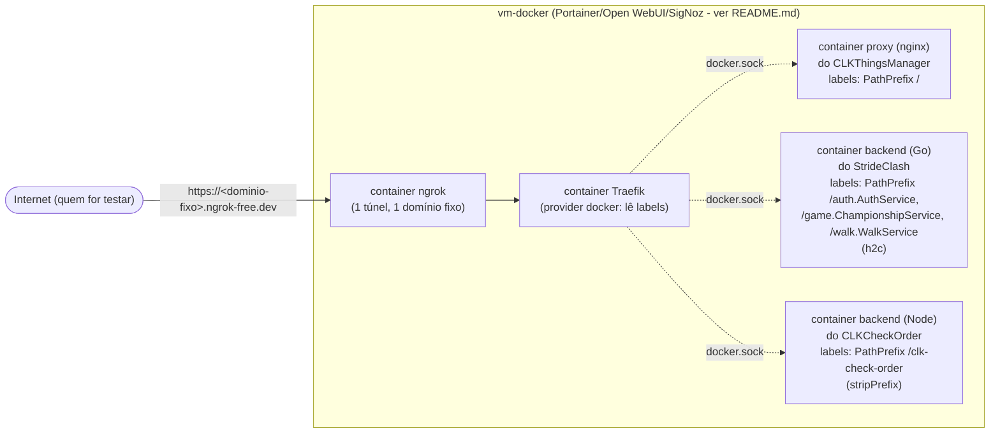

# Servidor de homologação (gateway Traefik + ngrok)

Spec de referência pros projetos que precisam de acesso externo pra teste e
validação (CLKThingsManager, StrideClash, CLKCheckOrder, ...). Compartilhe
este arquivo (ou o repo) entre eles - é aqui que fica documentado o que existe,
como funciona e como registrar um projeto novo.

## O que é isso

Cada projeto já sabe subir sozinho (`docker-compose.yml` + `deploy.ps1`
próprios) e já sabia expor a si mesmo via ngrok (`docker-compose.ngrok.yml`
próprio). O problema: o plano **free** do ngrok só permite **1 domínio
estático reservado por conta** - com 3 projetos, só um teria endereço fixo por
vez, e os outros ganhariam uma URL aleatória a cada restart do container
ngrok (quebra `GRPC_HOST` do mobile, `SPOTIFY_REDIRECT_URI`, etc.).

A solução: **um único túnel ngrok**, apontando pro **Traefik**, que decide pra
qual projeto rotear cada requisição. Pra isso, CLKThingsManager e StrideClash
passaram a rodar na **mesma vm-docker** do gateway (não mais em hosts
próprios) - assim o Traefik descobre cada um automaticamente por **label no
`docker-compose.yml`** de cada projeto (provider `docker`), sem precisar
manter uma tabela de rotas separada aqui no HomeLabDevelopment.



Gerenciado por Ansible junto com o resto da `vm-docker` (Portainer, Open
WebUI, SigNoz): se o servidor for reformatado, um único `terraform apply`
recria a VM **e** sobe o gateway de novo. Arquivos:

- [`ansible/vm-docker.yml`](../ansible/vm-docker.yml) - tasks que criam a rede
  docker `edge` e sobem os containers Traefik/ngrok (seção "Gateway de
  homologação"). Traefik monta `/var/run/docker.sock` (somente leitura) pra
  ler labels dos outros containers.
- [`ansible/files/edge/traefik.yml`](../ansible/files/edge/traefik.yml) -
  config estática: provider `docker` (labels, `exposedByDefault: false`) +
  provider `file` (fallback manual, ver abaixo).
- [`ansible/files/edge/dynamic/routes.yml`](../ansible/files/edge/dynamic/routes.yml) -
  fallback do provider `file`, só usado por projeto que não rodar nesta
  vm-docker. Hoje vazio (CLKThingsManager e StrideClash usam labels).
- `terraform/variables.tf` / `terraform.tfvars` - `ngrok_authtoken` e
  `ngrok_url`.

Traefik e ngrok não são "um projeto" dos seus 3 apps - são infraestrutura
compartilhada, por isso vivem no HomeLabDevelopment (via Ansible) e não em
nenhum dos 3 projetos.

## Por que labels (e não uma tabela de rotas central)

Traefik tem dois jeitos de saber pra onde rotear: um provider `file` (você
escreve manualmente "essa URL vai pra aquele host:porta") ou um provider
`docker` (ele lê os containers do **mesmo Docker daemon** e monta a rota
sozinho a partir de labels no `docker-compose.yml` de cada um). O provider
`docker` só enxerga containers que rodam na mesma máquina que ele consulta
via `docker.sock` - por isso a mudança de arquitetura: CLKThingsManager
(antes num host próprio, `192.168.18.187`) passou a rodar na vm-docker
também, igual ao StrideClash (que, por coincidência, já rodava lá).

Resultado prático: registrar um projeto novo (se ele rodar na vm-docker) não
toca em nada neste repo - é só label no `docker-compose.yml` dele (foi assim
que o CLKCheckOrder entrou). O provider `file`/`routes.yml` continua
existindo só como fallback pra um projeto que por algum motivo tenha que
ficar num host separado (nesse caso, sim, é preciso editar `routes.yml`
manualmente - ver o bloco comentado lá).

## Por que path-based e não subdomínio

Domínio estático grátis do ngrok = 1 hostname só (sem wildcard de
subdomínio). Por isso o roteamento é por **caminho da URL** (`PathPrefix`),
não por subdomínio:

- **CLKThingsManager** é o único que precisa ser aberto num browser (é o
  "front"), então fica no catch-all (`/`, prioridade mais baixa - label
  `traefik.http.routers.clk-things-manager.priority=1`) - continua acessível
  na raiz do domínio, sem path extra.
- **StrideClash** é consumido só pelo app mobile (gRPC), nunca por um
  browser, então não faz diferença pra ele estar atrás de um path. As chamadas
  gRPC já chegam com o caminho `/pacote.Serviço/Método` (nome do pacote
  `.proto` - `auth`, `game`, `walk`, ver `StrideClash/proto/*.proto`) - as
  labels roteiam por esse prefixo natural (prioridade mais alta - `100` -
  pra não cair no catch-all do CLKThingsManager), sem `StripPrefix` (que
  quebraria a chamada gRPC).
- **CLKCheckOrder** não tem prefixo natural único (as rotas do Express são
  soltas - `/auth`, `/households`, `/products`... - ver
  `CLKCheckOrder/backend/src/app.ts`), diferente do StrideClash. Por isso um
  prefixo manufaturado (`/clk-check-order`) + label
  `traefik.http.middlewares.clk-check-order-strip.stripprefix.prefixes=/clk-check-order`,
  igual o proxy nginx do CLKThingsManager faz por dentro (só que aqui é o
  Traefik quem tira o prefixo, não um nginx do próprio projeto).

## O que está registrado hoje

| Projeto | Como chega | Onde roda | Roteamento | Status |
|---|---|---|---|---|
| CLKThingsManager | `/` (catch-all) | vm-docker, serviço `proxy` (nginx) | label Docker | ativo |
| StrideClash (backend gRPC) | `/auth.AuthService`, `/game.ChampionshipService`, `/walk.WalkService` | vm-docker, serviço `backend` | label Docker (h2c) | ativo, **verificar na prática** (ver Limitações) |
| CLKCheckOrder (backend REST) | `/clk-check-order` (com stripPrefix) | vm-docker, serviço `backend` | label Docker | ativo, **verificar na prática** (recém-criado) |

Labels de cada projeto: `CLKThingsManager/docker-compose.yml` (serviço
`proxy`), `StrideClash/docker-compose.yml` (serviço `backend`) e
`CLKCheckOrder/docker-compose.yml` (serviço `backend`). Fallback manual (só
se algo não rodar na vm-docker):
[`ansible/files/edge/dynamic/routes.yml`](../ansible/files/edge/dynamic/routes.yml).

## Como registrar um projeto novo

**Se o projeto vai rodar na vm-docker** (recomendado - é o que dá o
"zero-touch" aqui no HomeLabDevelopment):

1. No `docker-compose.yml` do projeto, no serviço que deve ser alcançável de
   fora (o que serve HTTP/gRPC - não o banco):
   - adiciona a rede externa `edge` (junto com a rede `default` do próprio
     projeto - ver exemplo em `StrideClash/docker-compose.yml` ou
     `CLKThingsManager/docker-compose.yml`);
   - adiciona as labels `traefik.enable=true` +
     `traefik.http.routers.<nome>.rule=...` +
     `traefik.http.services.<nome>.loadbalancer.server.port=<porta interna>`
     (e `...scheme=h2c` se for gRPC sem TLS, como o StrideClash).
2. Ajusta o `deploy.ps1` do projeto pra apontar pro IP da vm-docker (`terraform
   output vm_ipv4` no HomeLabDevelopment) em vez de um host próprio.
3. Roda o `deploy.ps1` do projeto normalmente. **Pré-requisito**: a rede
   `edge` precisa já existir na vm-docker (criada pelo `ansible/vm-docker.yml`
   - já rodou se o gateway já foi provisionado ao menos uma vez via
   `terraform apply`). Sem isso, o `docker compose up` falha com "network
   edge declared as external, but could not be found".
4. Atualiza a config do lado do projeto (mobile `.env`, `PUBLIC_BASE_URL`,
   etc.) pra apontar pro **domínio fixo do gateway**, em vez de subir o
   `docker-compose.ngrok.yml` próprio do projeto.

**Se o projeto vai ficar num host separado** (não dá pra colocar na
vm-docker): usa o fallback do provider `file` -  edita
[`ansible/files/edge/dynamic/routes.yml`](../ansible/files/edge/dynamic/routes.yml)
com um `router`+`service` apontando pro host:porta (bloco comentado lá serve
de modelo genérico) e roda `terraform apply` (detecta a mudança pelo hash do
arquivo) ou o Ansible direto (comando de exemplo no topo de
`ansible/vm-docker.yml`).

O `docker-compose.ngrok.yml` de cada projeto continua existindo e funcionando
- serve como fallback pra testar um projeto sozinho, sem depender do gateway
  (ex: pra debugar algo isolado, sem subir tudo). Só não dá pra rodar ele **e**
  o gateway ao mesmo tempo com domínio fixo nos dois - plano free só reserva 1.

## Onde roda

Na `vm-docker` (a VM Docker do HomeLabDevelopment que já tem Portainer +
Open WebUI + SigNoz - ver `README.md`), gerenciada por Ansible junto com o
resto (ver "Por que Ansible" abaixo). Reaproveitada de propósito em vez de
criar uma VM/LXC nova: sem custo de RAM/CPU adicional do host Proxmox (que já
roda no limite - ver `README.md`) nem a complexidade de Docker dentro de um
LXC novo (precisaria de `nesting`/`keyctl`, como foi feito pro `lxc-ollama`
com a GPU).

CLKThingsManager e StrideClash rodam **na mesma vm-docker** agora (de
propósito - é o que permite o roteamento por label, ver "Por que labels"
acima). Se o host de 4 cores/15GB RAM apertar com tudo isso junto
(Portainer + Open WebUI + SigNoz + gateway + 2 stacks de projeto), ajuste
`cores`/`memory` de `vm_id` em `terraform.tfvars`.

Portas usadas na vm-docker (verificar que estão livres antes do primeiro
apply - nenhum serviço atual da VM parece usar a 80, mas confirme com
`sudo ss -tlnp | grep -E ':80|:8090|:4042'` antes):

| Serviço | Porta | Exposto pelo ngrok? |
|---|---|---|
| Traefik (entrada HTTP) | 80 | sim (é o que o túnel aponta) |
| Traefik (dashboard) | 8090 | não - só LAN |
| ngrok (dashboard local) | 4042 | não - só LAN |

### Por que Ansible (e não uma pasta com `docker-compose.yml` + `deploy.ps1`)

A primeira versão disto era uma pasta `edge/` separada, no mesmo estilo dos
outros projetos (deploy manual via SCP). Foi trocado pra Ansible porque a
teoria deste repo é: **se o servidor for reformatado, `terraform apply`
recria tudo sozinho** - e isso só vale se o gateway estiver no mesmo
pipeline Terraform+Ansible que já provisiona `vm-docker`/`lxc-ollama`/
`lxc-postgres`, não num script à parte que precisaria ser lembrado e rodado
na mão depois.

## Deploy / operação

Primeira vez (ou depois de reformatar o servidor):

```powershell
cd terraform
terraform apply
```

`ngrok_authtoken`/`ngrok_url` já ficam no `terraform.tfvars` (não
versionado). Isso recria a vm-docker (se precisar) e sobe Portainer, Open
WebUI, SigNoz **e** o gateway (rede `edge` + Traefik + ngrok) juntos. Só
depois disso rode o `deploy.ps1` do CLKThingsManager/StrideClash (precisam da
rede `edge` já existindo).

Só mudou `traefik.yml` ou o fallback `routes.yml`? Não precisa recriar a VM -
`terraform apply` detecta a mudança pelo hash do arquivo e reaplica só a
parte do Ansible (ou rode o Ansible direto, ver comando de exemplo no topo de
`ansible/vm-docker.yml`, pra pular o plan/apply inteiro). Mudou labels num
projeto (CLKThingsManager/StrideClash)? Só rodar o `deploy.ps1` **daquele
projeto** de novo - o Traefik enxerga a mudança sozinho (provider `docker`
observa o Docker daemon, não precisa de nada no HomeLabDevelopment).

- Ver a URL pública: dashboard do ngrok (`http://<ip-vm-docker>:4042`) ou
  `docker logs ngrok` na vm-docker.
- Ver pra onde o Traefik está roteando: dashboard do Traefik
  (`http://<ip-vm-docker>:8090/dashboard/`) - mostra os routers vindos de
  labels e os vindos do `file` separadamente.

## Limitações / o que ainda não foi validado ao vivo

- **h2c pro StrideClash**: a label
  `traefik.http.services.stride-clash-grpc.loadbalancer.server.scheme=h2c`
  é a forma documentada oficialmente pelo Traefik pra backends gRPC em
  cleartext ([guia gRPC do Traefik](https://doc.traefik.io/traefik/v3.3/user-guides/grpc/)),
  mas ainda não foi testado com uma chamada real do app StrideClash através
  do gateway. Se falhar, o fallback é continuar usando o
  `docker-compose.ngrok.yml` próprio do StrideClash (túnel dedicado, sem
  passar pelo Traefik) enquanto isso não é depurado.
- **Rede `edge` precisa existir antes do primeiro deploy do CLKThingsManager/
  StrideClash** nesse novo host - é criada pelo Ansible do gateway (ver
  "Deploy / operação"). Se o `docker compose up` desses projetos rodar antes
  disso, falha com "network edge declared as external, but could not be
  found".
- **Porta 80 livre na vm-docker**: não confirmado - ver tabela acima.
- **Recursos da vm-docker**: agora concentra Portainer + Open WebUI + SigNoz +
  gateway + os 3 projetos (antes cada um tinha host próprio) - vale
  acompanhar uso de CPU/RAM depois do primeiro deploy de verdade.
- **CLKCheckOrder**: `Dockerfile`/`docker-compose.yml`/`deploy.ps1` recém
  criados - ainda não validado com uma chamada real do app mobile através do
  gateway (nem local, fora do Docker, antes disso).
- **Isso é homologação, não produção**: sem TLS entre Traefik e os backends,
  dashboards do Traefik/ngrok sem autenticação (mitigado por estarem só na
  LAN, nunca tunelados), `docker.sock` montado no Traefik (leitura, mas ainda
  assim é acesso privilegiado de fato ao Docker daemon) - adequado pra teste
  e validação, não pra expor dado sensível de verdade.
